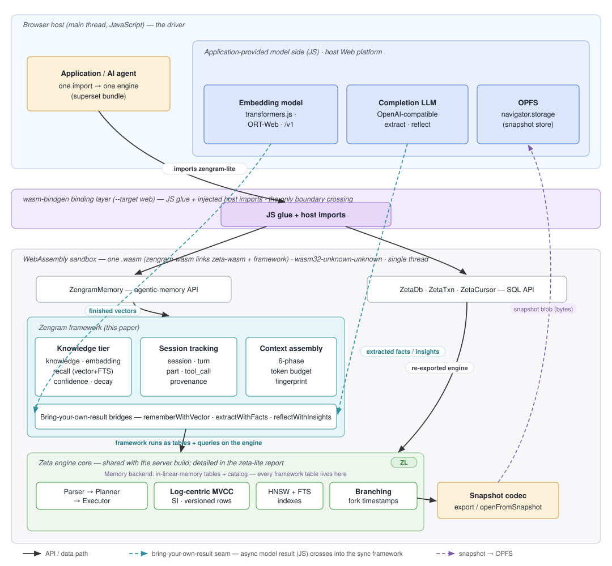
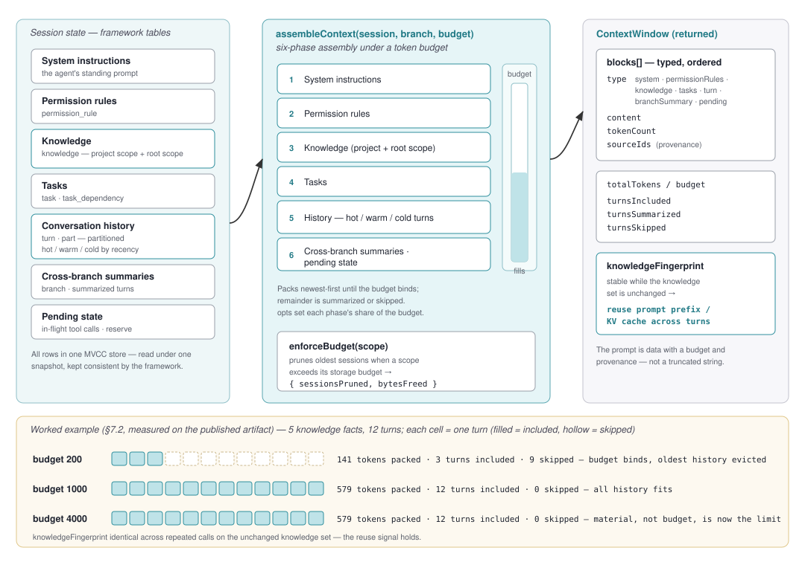

# Zengram-Lite: An In-Browser Agentic-Memory Framework — Semantic Knowledge, Session Tracking, and Token-Budgeted Context

> **Draft — sections in prose.** This file carries the fully-written sections; the
> section skeleton and framing decisions live in `outline.md`. The companion
> **zeta-lite** report [ZL] is the account of the SQL/MVCC engine underneath;
> zengram-lite is a *superset* of that engine, so this paper summarizes the engine
> in §3 and cites [ZL] rather than repeating it. Every measurement is reproducible
> from the public repository against the *published* artifact.

---

## Abstract

AI agents increasingly run in the browser, and they need somewhere to keep what
they learn. The client-side state of the art, however, is a vector index — nearest-
neighbor search over embeddings — with the rest of an agent's memory left to
application code: the conversation history is an array in `localStorage`, context
management is hand-rolled truncation, and there is no shared notion of a fact's
confidence, its provenance, or the session that produced it. A vector store is not
a memory *framework*.

We present **zengram-lite**, an agentic-memory framework compiled to a single
~2.95 MB gzipped WebAssembly artifact that runs entirely in a browser tab. It
provides three tiers over one transactional store. The **knowledge** tier offers
hybrid vector-and-full-text recall with a fact *lifecycle* — confidence that rises
and falls as facts are confirmed or contradicted, importance that decays over time,
supersession that treats a restated fact as an update rather than a duplicate, and
scope namespacing. The **session-tracking** tier models the conversation itself as
first-class data: sessions, turns, typed content parts, and tool calls with state
and timing, all as queryable tables rather than an opaque message log. The
**context-assembly** tier turns that structure into a token-budgeted prompt through
a six-phase assembly that packs system instructions, knowledge, and recent history
under a caller's budget, and returns a stable fingerprint that signals when a prompt
prefix can be reused. The bundle is a **superset** of the zeta-lite SQL engine [ZL]
— the same `.wasm` re-exports the full Postgres-compatible surface, MVCC snapshot
isolation, and copy-on-write database branching — so memory inherits transactional
consistency across all three tiers and branchable state for free. Because the wasm
surface is synchronous while the framework's canonical operations depend on an
asynchronous LLM and embedder, zengram-lite exposes a **bring-your-own-result** seam
that runs the framework's real code paths over results the application computes in
JavaScript. This is a v0.1 preview; §8 states its boundaries plainly.

---

## Availability

The compiled zengram-lite bundle is published to npm as `zengram-lite` and attached
to GitHub Releases; it is free for any use, including commercial, though the
framework and engine source are closed (the WebAssembly build is *distributed*, not
open source). The hand-authored surface — three interactive demo pages (an
agent-memory demo, the full SQL playground, and a local AI agent that runs its loop,
tools, and memory in the tab), the API reference, and the smoke/e2e harnesses used
in this paper — is public at **https://github.com/genezhang/zengram-lite**. Every
measurement in §7 is reproducible from that repository against the *published*
artifact: the artifact size (`gzip -c demo/pkg-web/zengram_wasm_bg.wasm | wc -c`),
the memory-core and agent-loop smoke tests (`node demo/smoke.mjs`, `node
demo/smoke_agent.mjs`), the real-model recall test (`node demo/smoke_model.mjs`),
and the headless-browser DOM test (`node demo/e2e_ops.mjs`). The companion engine
report is [ZL].

---

## 1. Introduction

Agents have moved into the browser. A growing class of applications run an agent
loop — plan, call tools, observe, repeat — inside a tab, for the same reasons data
moved client-side generally: privacy, offline operation, and the absence of a
server round-trip between a thought and the state that records it. Such an agent
needs memory. It needs to remember facts it has learned and recall them later by
meaning; it needs to keep track of the conversation it is having, the tools it has
called and how they turned out; and it needs, on every turn, to assemble a prompt
that fits a model's context window out of far more material than will fit.

The dominant answer today is a vector store. Libraries embed text with a model
running in the tab (transformers.js, ORT-Web) and index the vectors for
nearest-neighbor search, typically over IndexedDB. This is genuinely useful and it
is the part of agent memory that is well served in the browser. But it is only one
part. A vector store has no notion of a fact's confidence or whether it has since
been contradicted; it does not model the conversation, so the session history, the
turns, and the tool calls are left to the application to keep in ad-hoc structures;
and it offers nothing for the actual hard problem of each turn — deciding what to
put in the prompt and what to leave out under a token budget. In practice a browser
agent assembles its memory from a vector index plus a pile of hand-written glue, and
the glue is where the framework should be.

Server-hosted agent-memory frameworks do model these things. Systems in the mem0 /
MemGPT / Letta lineage provide a fact store, conversational memory, and context
management as a coherent library — but they run in a Python or Node process on a
server, which puts both the framework and the user's data back on the far side of a
network. For a browser agent that exists precisely to keep computation and data on
the device, that is the wrong deployment.

We take a different bet. **Zengram-lite** compiles a complete agentic-memory
framework to WebAssembly and runs it entirely in the tab, over a transactional SQL
engine that ships in the same artifact. It is the browser form factor of the closed
Zengram framework, and it is a **superset** of the zeta-lite database engine [ZL]:
the glue crate `zengram-wasm` links the engine and the framework into one cdylib, so
a single `.wasm` exports both the full SQL surface (`ZetaDb`/`ZetaTxn`/`ZetaCursor`)
and the memory tier (`ZengramMemory`). A page that needs memory and SQL loads one
engine, not two. On top of that engine the framework provides three tiers — a
knowledge tier with a fact lifecycle, a session-tracking tier that models the
conversation as data, and a context-assembly tier that produces a token-budgeted
prompt — each backed by real tables the framework keeps consistent.

**Contributions.**

1. **A knowledge tier that is a system, not a store** (§4): hybrid vector-and-
   full-text recall with a fact lifecycle — confidence adjusted by
   confirm/contradict, importance that decays with a half-life, supersession of
   restated facts, scope namespacing, and provenance back to the turn that produced
   a fact.
2. **First-class, client-side session tracking and token-budgeted context
   assembly** (§5): sessions, turns, typed parts, and tool calls as queryable
   tables, and a six-phase `assembleContext` that packs a prompt under a token
   budget and returns a stable reuse fingerprint. This is the tier that lets a
   browser agent run its whole loop in the tab, and the one no other in-browser
   memory system provides.
3. **Running an LLM-dependent framework on a synchronous wasm surface** (§6): the
   **bring-your-own-result** seam that resolves the mismatch between a synchronous
   wasm API and the asynchronous LLM/embedder the framework's canonical operations
   need, by running the framework's real code paths over results the application
   computes in JavaScript.
4. **The superset embodiment** (§3): the whole framework plus a full transactional
   SQL engine with copy-on-write branching in one ~2.95 MB artifact, with a choice
   of isolated or shared engine, over the zeta-lite core [ZL].
5. **Position in the Zeta/Zengram family**: the smallest, most complete public form
   of the closed framework, and the in-browser teaser for it.

Throughout, the argument is that the missing piece on the client side was never the
vector index — that part is solved — but the *framework* around it: the lifecycle,
the session model, and the context assembly that together make stored vectors behave
like memory. Zengram-lite is a v0.1 preview; §8 is explicit about what is and is not
wired yet.

## 2. Background and Related Work

**Agent-memory frameworks.** A line of systems treats an agent's memory as a
first-class component rather than a bare vector index. MemGPT / Letta [1] frame the
context window as a managed resource, paging information between an in-context
working set and external storage; mem0 [2] provides a fact-extraction-and-recall
memory layer for LLM applications; retrieval frameworks such as LangChain and
LlamaIndex [3] bundle conversational memory and context construction. These share
the shape zengram-lite adopts — a store plus a lifecycle plus context management —
but they are built to run server-side, in a Python or Node process, with the store
frequently a hosted vector database. Zengram-lite's difference is deployment: the
*entire* framework, store included, runs in the browser tab, so an agent's memory
and the user's data never leave the device.

**Vector search in the browser.** The client-side building block that is well
established is embedding-plus-nearest-neighbor. Embedding models run in the tab via
transformers.js or ONNX Runtime Web, and vectors are indexed with in-wasm HNSW
libraries or stored in IndexedDB. These are the right tool for semantic recall, and
zengram-lite uses exactly this class of embedder at its boundary (§6.2). What they
are not is a memory framework: they carry no fact lifecycle, no session or turn
model, and no context assembly. They are the substrate the knowledge tier sits on,
not a substitute for the framework.

**Client-side agent state as it is built today.** Absent a framework, a browser
agent keeps its conversation in application structures — an array of messages in
`localStorage` or IndexedDB — and manages context by hand, typically truncating to
the last *k* turns. Tool calls are logged, if at all, in the same ad-hoc way, with
no shared schema tying a stored fact to the turn and tool call that produced it.
This is the status quo zengram-lite is meant to replace with a coherent, queryable
model.

**The engine.** Zengram-lite is a superset of **zeta-lite** [ZL], whose report is
the account of the underlying database: a log-centric asynchronous MVCC engine that
sustains overlapping snapshot-isolated transactions on a single wasm thread, exposes
a feature-complete Postgres surface (JSONB with GIN, full-text search, HNSW vector
search, SQL/PGQ graph queries, multi-database), offers copy-on-write whole-database
branching, and persists via snapshot to the Origin Private File System without a
worker, `SharedArrayBuffer`, or cross-origin-isolation headers. We summarize what
the framework inherits in §3 and refer to [ZL] for the mechanism and its evaluation;
this paper does not re-argue the engine.

**The delta.** To our knowledge, no in-browser system offers a coherent
agentic-memory framework — a knowledge tier with a lifecycle, first-class session
tracking, and token-budgeted context assembly — as a single client-side artifact.
Zengram-lite provides one, over a transactional engine, in ~2.95 MB.

---

## 3. The Zeta Substrate

Zengram-lite is a framework, but it is not a framework in isolation: it runs over
the Zeta database engine, and much of what makes it viable in a browser is inherited
from that engine rather than built anew. This section states what is inherited and
points to the companion report [ZL] for the account of how; it deliberately does not
re-derive the engine. Figure 1 gives the whole picture — the two API surfaces the
one `.wasm` exports, the framework tiers, the shared engine core, and the seams that
cross into the browser host.

**Figure 1. Zengram-lite superset architecture: the Zengram framework tiers (teal) as tables and queries over the shared Zeta engine core (green, detailed in the zeta-lite report), inside one wasm module that also re-exports the SQL surface. The bring-your-own-result seam (teal, dashed) carries async model results from the JS side into the synchronous framework.**

### 3.1 What zengram-lite inherits

From zeta-lite [ZL], the framework gets, without adding code of its own:

- **A transactional store with snapshot isolation.** The memory tiers are tables in
  a log-centric MVCC engine, so a write that spans knowledge, session, and
  provenance tables is one consistent transaction rather than a multi-store
  reconciliation problem.
- **The retrieval primitives.** HNSW vector indexing and full-text search are engine
  features; the knowledge tier's hybrid recall (§4.2) is a query over them, not a
  separate index the framework maintains.
- **Copy-on-write branching.** The engine can fork the whole database at the cost of
  a timestamp [ZL §3.6]. Memory can therefore be branched — an agent can explore a
  speculative line of memory and merge or discard it — which the framework surfaces
  as in-bundle memory branching (exposed in a later release; §8).
- **Snapshot-to-OPFS durability.** The whole database serializes to a byte blob and
  rehydrates from one, on the main thread, with no worker or special headers [ZL
  §5]. Memory persistence (§6.4) is this mechanism.
- **A small, headers-free artifact.** The engine is ~2.87 MB gzipped and runs in any
  browser context with OPFS. The framework adds little on top (§7.3).

When this paper says "the store," "recall," or "branching," it means the engine's,
via [ZL]. The novelty argued here is the framework above them.

### 3.2 The superset bundle

The glue crate `zengram-wasm` links `zeta-wasm` and the Zengram framework into a
single cdylib, so one compiled `.wasm` exports the full SQL engine
(`ZetaDb`/`ZetaTxn`/`ZetaCursor`) *and* the memory tier (`ZengramMemory`). This is
the concrete meaning of "superset": a page that needs both a SQL database and agent
memory imports one package and instantiates one engine, with no double-load and no
second wasm heap. zeta-lite remains the lean, SQL-only package for pages that need
only the database; zengram-lite is the strict superset for pages that also need
memory. The cost of the framework tier on top of the engine is small — §7.3 measures
it at roughly 0.08 MB gzip over the engine's 2.87 MB.

### 3.3 Why memory over a SQL engine

Building agent memory over a transactional SQL engine, rather than as a bespoke
store, is what makes the three tiers a single system. The knowledge tier is HNSW and
full-text indexes over the `knowledge` and `embedding` tables; the session tier is
rows in `session`, `turn`, `part`, and `tool_call`; provenance is foreign-key-shaped
relationships among them. A recall, a turn append, and the fact-extraction that links
new knowledge back to the turn it came from all commit in the same engine, under the
same snapshot isolation. The alternative — a vector database beside a document store
beside a hand-rolled session log — has no single point of consistency; here there is
one. This is the payoff of putting the framework on the engine rather than beside it.

---

## 4. The Knowledge Tier

The knowledge tier is what most systems mean by "agent memory": store facts, recall
them by meaning. Zengram-lite's difference is that a fact is not a frozen vector but
a row with a lifecycle.

### 4.1 What a fact is

A fact is a row in the `knowledge` table. It carries a **subject** (a short label
such as `"editor prefs"`), the **content** (the fact as a sentence), a **scope** (a
free-form namespace string such as `"agent/session-42"`), a **confidence** and an
**importance** (each in 0..1), a lifecycle **status**, counters for how many times
it has been confirmed and contradicted, and update timestamps that drive decay.
Recall is always within a scope, so scopes partition an agent's memory into
namespaces — per project, per session, per user — over one store.

### 4.2 Remember and recall

`remember(subject, content, scope)` embeds the fact — as the string
`"subject: content"` — and stores it, returning a knowledge id. `recall(query,
scope)` runs a **hybrid vector-and-full-text** search over the scope's facts and
returns them ranked by meaning, each hit carrying a similarity score and the fact's
importance. The vector half is the point: a query with no keyword overlap with a
stored fact still retrieves it. §7.1 shows this with real all-MiniLM vectors — asking
"what hot beverage do I like?" recalls a stored "drinks green tea" fact that shares
no words with the query.

Facts with the **same subject in a scope are treated as updates**, not duplicates:
restating a subject supersedes the prior fact rather than accumulating a near-copy.
The application stores distinct subjects for distinct facts and lets supersession
handle restatement. `remember` stores content **verbatim** — it does not split prose
into atomic facts on its own; automatic extraction is the bring-your-own-result path
of §6.2.

### 4.3 The lifecycle: confidence, importance, decay

What makes the tier *memory* rather than a static index is that facts change
standing over time, through deterministic operations that need no model and run
before an embedder is even wired:

- **`confirm(id)`** — the fact was seen or validated again; its confidence rises.
- **`contradict(id)`** — the fact turned out wrong; its confidence falls.
- **`decay(halfLifeDays)`** — importance decays exponentially with the given
  half-life, charging only the time since each fact's last decay, and returns the
  number of facts touched. Run periodically, it fades stale memory so the store
  does not grow without bound over months.

These are the operations that distinguish a memory from a log: a fact the agent
keeps re-encountering strengthens, one the world contradicts weakens, and one
nothing touches quietly fades. `factsAboutPeer(peer, limit)` returns the active facts
attributed to a given peer, most important first, for memory that is about *who* said
or did something, not only *what*.

### 4.4 Provenance

A fact derived from a conversation carries where it came from. When the
fact-extraction bridge (§6.2) stores facts from a turn, it records session and turn
provenance on each, so a recalled fact can be traced back to the exact turn that
produced it. The framework compiles a fuller provenance-tracing surface
(`traceBack`/`traceForward`) that a later release will expose typed (§8); in v0.1 the
provenance is recorded and inspectable via SQL.

---

## 5. The Session-Tracking Tier

This is the tier that separates a memory framework from a vector store, and the one
that makes "run the agent in the tab" tractable. It models the conversation itself as
data, and it turns that data into a prompt.

### 5.1 The conversation as data

An agent's transcript is usually an opaque array of messages. Zengram-lite models it
as a small relational structure the framework keeps consistent:

- A **session** (`session`) is one run of the agent, created under a project scope,
  with its own trunk branch.
- A **turn** (`turn`) is one exchange — user or assistant — carrying its role,
  lifecycle status, input/output token counts, cost, and finish reason.
- A **part** (`part`) is an atomic, typed content unit of a turn — a text part, a
  tool part — with a JSON payload and a position, so a turn's content is structured
  rather than a single string.
- A **tool call** (`tool_call`) records a tool invocation with a state machine
  (pending → running → completed or error), a category, target paths, timing, and
  token cost.

Because these are real tables, the transcript is queryable: "which tool calls
errored in this session," "how many tokens did this branch cost," "what parts made
up that turn" are SQL, not application bookkeeping.

### 5.2 The loop, in the bundle

Together these let a browser agent run its entire loop through the framework:
`createSession` opens a session and its branch; `appendTurn` and `addPart` record
each exchange; `recordToolCall` and `completeToolCall` bracket every tool use;
`assembleContext` (§5.3) builds the next prompt; and `extractWithFacts` /
`reflectWithInsights` (§6.2) fold what was learned back into the knowledge tier. The
`smoke_agent.mjs` harness walks exactly this sequence against the real artifact and
checks it end to end (§7.1). None of it requires a server: the record of the
conversation, the prompt assembly, and the derived memory all live in the tab.

### 5.3 Token-budgeted context assembly

The operation an agent performs most and a vector store helps with least is building
the next prompt. On every turn the agent has more material — system instructions,
relevant knowledge, recent history, pending tool state — than fits the model's
window, and must choose what to include. Zengram-lite makes this the framework's job.
Figure 2 shows the whole path: the session-state tables on the left, the six-phase
assembly under a budget in the middle, and the typed `ContextWindow` it returns on
the right, with the measured budget-eviction result of §7.2 along the bottom.

**Figure 2. Token-budgeted context assembly. `assembleContext` reads the session-state tables under one snapshot, packs them through six phases newest-first until the token budget binds, and returns a typed `ContextWindow` with per-block provenance and a reuse fingerprint. The bottom strip is the §7.2 measurement: at budget 200 only 3 of 12 turns are included (9 evicted); at budget 1000 and 4000 all 12 fit.**

`assembleContext(sessionId, branchId, budget, opts?)` runs a **six-phase** assembly
under a caller-supplied token budget. The phases, in order, are system instructions,
permission rules, knowledge, tasks, conversation history (partitioned hot / warm /
cold by recency), cross-branch summaries, and pending state; `opts` sets each phase's
share of the budget as a fraction. The knowledge phase reads the session's project
scope and the root scope, so facts stored there are eligible for injection. History
is packed newest-first until the budget binds, and the remainder is summarized or
skipped.

The return value is a structured `ContextWindow`, not a string: a list of typed
**blocks** (each with its type, content, token count, and the source ids it came
from), the total tokens used against the budget, counts of turns *included*,
*summarized*, and *skipped*, and a **`knowledgeFingerprint`** — a hash that is stable
for an unchanged knowledge set. That fingerprint is a reuse signal: when it is
unchanged between turns, the knowledge portion of the prompt prefix is identical and
a KV cache or a cached prompt prefix can be reused. §7.2 measures both behaviors —
the budget binding and evicting oldest turns, and the fingerprint holding stable
across identical knowledge — from the published artifact.

Storage-budget enforcement is the complementary operation: `enforceBudget(scope)`
prunes the oldest sessions when a scope exceeds its configured storage budget,
returning what it freed, so long-lived memory stays bounded.

### 5.4 Why this is the hard part

Storing vectors is the easy half of agent memory; the value is in what surrounds
them. Turning a growing, branching conversation into a bounded, reusable prompt —
under a schema that keeps the knowledge injected into that prompt consistent with the
facts the agent has confirmed, contradicted, and traced to their source — is the work
an application otherwise does by hand and does incompletely. Making it a framework
operation, with a budget, a fingerprint, and typed provenance-bearing blocks, is the
session tier's contribution, and §7.2 is its evidence.

---

## 6. Running a Framework on a Synchronous Browser Surface

A framework whose canonical operations call an LLM and an embedding model has a
problem in the browser that a pure database does not: those calls are asynchronous,
and the wasm surface it is invoked through is synchronous. This section describes the
mismatch and the seam that resolves it, plus the deployment choices around it.

### 6.1 The impedance mismatch

Query execution in the engine is synchronous on the single wasm thread [ZL §4.3], so
every method on the memory surface returns synchronously. But the framework's most
characteristic operations are inherently asynchronous in the browser: computing an
embedding means awaiting a model running in the tab (transformers.js, ORT-Web) or a
remote `/v1/embeddings` call, and extracting facts or reflecting over memory means
awaiting a completion model. A synchronous wasm method cannot `await`. A naive port
would either block the thread or require an async wasm surface the engine does not
have.

### 6.2 The bring-your-own-result seam

Zengram-lite resolves this by inverting the call. Rather than the framework reaching
out to an async model from inside a synchronous method, the application computes the
async result in JavaScript and hands the *finished* result to the framework, which
then runs its normal synchronous code paths over it. The seam has the same shape
everywhere it appears:

- **`rememberWithVector(subject, content, scope, vec)`** — the application awaits its
  embedding model and passes the finished vector; the framework stores it with all
  the usual lifecycle and provenance handling. (`setEmbedFn` registers a
  *synchronous* embedder for the simpler `remember`/`recall` path, which suits a
  lightweight or precomputed embedder; the `…WithVector` pair is for real async
  models.)
- **`extractWithFacts(turnText, scope, sessionId, turnId, facts)`** — the application
  calls its completion model to extract atomic facts from a turn and passes them in;
  the framework embeds each (via the registered embedder), dedupes and supersedes
  against existing knowledge, and stores them with session/turn provenance.
- **`reflectWithInsights(scope, insights, limit)`** — the application's model
  synthesizes higher-level insights over the scope's knowledge and passes them in;
  the framework folds them into memory the same way.

The important property is that these are not three special cases but one design: in
every one, the async work is the application's and the framework work — dedup,
supersession, embedding, provenance, storage — is the framework's real code path,
unchanged from how it runs elsewhere. The framework is not stubbed in the browser; it
is fed. What v0.1 does *not* do is call the model itself (§8): extraction and
reflection are bring-your-own-result, not automatic, precisely because the sync
surface cannot make the async call.

### 6.3 Engine modes: isolated or shared

Memory needs an engine, and the application chooses whether it gets its own or shares
one. `ZengramMemory.open(dim)` opens memory over a fresh, isolated engine with a
private catalog — the right choice when the page needs only memory, or wants memory's
storage in a separate trust domain from any SQL it runs. `ZengramMemory.overEngine(db,
dim)` builds memory over an existing `ZetaDb`'s engine — one wasm heap, one catalog —
so the application's SQL tables and memory's tables live in one database and can be
queried together. Both are first-class. In shared mode memory reserves the table
names its migrations create, so the application avoids colliding with them; the
migrations are idempotent (tracked in `_zengram_migrations`), so attaching memory over
an already-initialized or snapshot-restored engine is safe and cheap. The reserved set
is 46 names in the current build; §7.4 groups them and points to the authoritative
list rather than reproducing it.

### 6.4 Persistence

Durability is the engine's snapshot model [ZL §5], applied to the memory database:
`exportSnapshot()` serializes the whole database — in shared mode including the
application's SQL tables, since they are one database — to a `Uint8Array`, and
`ZengramMemory.openFromSnapshot(bytes, dim)` rehydrates it. There is no incremental
save; each snapshot is O(database size). The shipped browser agent (`demo/agent/`)
demonstrates the production pattern: a dirty flag set only by memory-writing turns, a
~60-second throttle so a run of new facts coalesces into a single save, and a flush on
tab hide or close. A clean quit loses nothing; a hard crash loses at most one throttle
window of facts. Snapshots are origin-agnostic bytes — the application stores them in
OPFS, IndexedDB, or ships them elsewhere.

---

## 7. Evaluation: Coverage, Framework Behavior, and Size

We evaluate the framework, not the engine. The engine's throughput, concurrency, and
soak behavior are zeta-lite's [ZL] and are inherited unchanged; re-running them here
would measure the same engine. What this section establishes is that the framework
layer *works, completely, in the target environment* — shown by harnesses that drive
the real artifact — that its distinctive session-tier behavior is as described (§7.2),
and that the whole superset fits the size envelope claimed (§7.3). All measurements
run against the **published** artifact and reproduce from the public repository.

### 7.1 Functional coverage

Four harnesses drive the compiled artifact through the framework's surface:

- **`smoke.mjs`** exercises the memory core and the re-exported engine surface —
  remember and recall (with a toy embedder), confirm/contradict moving confidence,
  decay, snapshot export-and-restore preserving recall, peer-attributed facts, and
  raw `query()` over the memory tables. **19 checks, all passing.**
- **`smoke_agent.mjs`** walks the full agent loop against the same artifact —
  `createSession`, `appendTurn`/`addPart`, `recordToolCall`/`completeToolCall`,
  `assembleContext`, and the `extractWithFacts` / `reflectWithInsights` bridges.
  **27 checks, all passing.**
- **`smoke_model.mjs`** replaces the toy embedder with real all-MiniLM-L6-v2 vectors
  and confirms **zero-keyword-overlap recall**: queries sharing no words with the
  stored facts retrieve the right ones, which is the property that distinguishes
  semantic recall from text matching.
- **`e2e_ops.mjs`** drives the real demo page in headless Chromium — the DOM path the
  Node smokes cannot reach — typing facts into the form, clicking the confirm/
  contradict and decay controls, and asserting the confidence bars move.

Together these cover every tier: the knowledge lifecycle, the session/turn/tool-call
model, context assembly, the bring-your-own-result bridges, persistence, and the
real embedding path, each against the artifact the demos actually load.

### 7.2 Context assembly under a token budget

This is the session tier's distinctive claim, and it is directly reproducible. We
seed a session with five knowledge facts and twelve turns, then call
`assembleContext` at three budgets and observe what it packs:

| Token budget | Total tokens packed | Turns included | Turns skipped | Blocks |
|---:|---:|---:|---:|---|
| 200 | 141 | 3 | 9 | system, knowledge, 3× turn |
| 1000 | 579 | 12 | 0 | system, knowledge, 12× turn |
| 4000 | 579 | 12 | 0 | system, knowledge, 12× turn |

At a tight budget of 200 tokens the assembly includes the system and knowledge blocks
and only the three most recent turns, **skipping the other nine** — the budget is the
binding constraint and it evicts oldest history first. Given room (budget 1000), all
twelve turns fit at 579 tokens; raising the budget to 4000 changes nothing, since the
material, not the budget, is now the limit. Across repeated calls on the **unchanged**
knowledge set, the `knowledgeFingerprint` is byte-for-byte identical, confirming the
reuse signal is stable: an agent can compare fingerprints between turns and reuse a
cached prompt prefix when knowledge has not changed. Both behaviors — budget-bound
eviction and fingerprint stability — are what §5.3 describes, measured on the
published bundle.

### 7.3 Artifact size

The published `zengram_wasm_bg.wasm` is **10,400,328 bytes raw / 2.95 MB gzipped**.
The comparison that matters is against the engine it supersets: zeta-lite is 2.87 MB
gzipped [ZL §7.4]. The entire agentic-memory framework — the knowledge lifecycle, the
session/turn/tool-call model, context assembly, and the bring-your-own-result bridges
— therefore adds on the order of **0.08 MB gzip** on top of the SQL engine already
present. This is the concrete meaning of the superset design: a page that would load
zeta-lite for its database can load zengram-lite instead and gain the whole memory
framework for a few percent more transfer, with no second engine and no second
download.

### 7.4 The schema, by tier

The framework's schema is 46 tables in the current build. Rather than enumerate them,
we group them by role:

- **Knowledge**: `knowledge`, `embedding` — the fact store and its vectors.
- **Session tracking**: `session`, `turn`, `part`, `tool_call`, `session_share` — the
  conversation model of §5.
- **Provenance and audit**: `provenance`, `event_log`, `file_operation` — where facts
  and actions came from.
- **Scoping and identity**: `project`, `account`, `account_state`, `environment`,
  `peer`, `workspace`, `workspace_file`, `branch`.
- **Configuration**: `_zengram_config`, `_zengram_migrations`, `retrieval_config`,
  `extraction_config`, `demotion_config`, `storage_budget`, `token_estimate`.
- **Persistence**: `snapshot`, `state_snapshot`.
- **Compiled-in, not yet exposed** (§8): task management (`task`, `task_dependency`,
  `task_file`, `scheduled_job`), reminders (`reminder`), permission rules
  (`permission_rule`), subagent runs (`subagent_run`), a code graph (`cg_node`,
  `cg_edge`, `cg_file`, `cg_source`, `cg_degree`), an object-knowledge format
  (`okf_bundle`, `okf_concept`, `okf_link`), and fleet/mailbox coordination
  (`agent_registry`, `agent_mailbox`, `mailbox_cursor`, `file_reservation`).

The authoritative, always-current list is in the repository (`docs/engine-modes.md`)
and is reachable at runtime via `db.schema()`; the set grows with the framework, and
the reserved-name caveat of §6.3 tracks it. That the compiled build already carries
tables for tasks, reminders, permissions, and coordination — reachable via SQL today,
typed later — indicates the scope of the closed framework this build fronts.

### 7.5 End to end: the shipped local agent

The strongest evidence that the framework is a working system, not a set of passing
unit tests, is the local agent shipped in `demo/agent/`. Its loop, its tools
(memory, OPFS files, web fetch), and its memory all run in the browser tab; only LLM
inference is a remote call to an OpenAI-compatible endpoint the user configures. It
stores facts as it learns them, recalls them by meaning on later turns, records its
tool calls, and snapshots its memory to OPFS on a throttle — so the memory survives a
full browser restart, not merely a reload. Everything §4 through §6 describes runs in
that page, driven by a real model, which is the framework operating as intended.

---

## 8. Limitations and Future Work

Zengram-lite is a v0.1 preview, and its boundaries are deliberate and stated.

**Extraction and reflection are bring-your-own-result, not automatic.** Because the
wasm surface is synchronous and the completion model is asynchronous (§6.1), the
framework cannot call the model itself; the application supplies the extracted facts
and synthesized insights. Correspondingly, `remember` stores content verbatim and
does not split prose into atomic facts on its own. When an async bridge lands,
automatic extraction becomes possible; in v0.1 it is the caller's step.

**Much of the compiled framework is not yet exposed as a typed surface.** The build
carries more than the JS API currently exposes: episodic timelines
(`session_timeline`, `turns_since`), provenance tracing (`traceBack`/`traceForward`),
the event log, reminders, permission rules, turn summarization, and in-browser memory
branching (`fork`/`merge`/`rebase`). These are reachable today only by querying their
tables with `query()`; a wider typed JS surface is planned. (Fleet coordination,
pgwire, and object-knowledge ingest are excluded from the browser build by design —
they belong server-side and pull native dependencies.)

**Durability is snapshot-based, and inherited.** A committed change is durable only as
of the last snapshot the application persisted; there is no incremental save, and each
snapshot is O(database size). This is zeta-lite's persistence model [ZL §5.3], with its
window; the related engine limitation that snapshots do not yet capture branches [ZL
§8] applies to memory branching too.

**Framework evidence is functional, not throughput.** This paper measures coverage,
context-assembly behavior, and size; it adds no framework micro-benchmarks. Engine
performance — where the operations' cost actually lives — is zeta-lite's [ZL], and the
memory tiers are ordinary tables and queries over that engine.

**Future work** centers on exposing the compiled-in surface (episodic timelines,
provenance tracing, memory branching) as typed APIs, wiring automatic extraction when
an async model bridge is available, and — beyond the teaser — the closed Zengram
framework and Zeta engine this build fronts.

## 9. Conclusion

The client side has had vector stores for a while; what it has lacked is a memory
*framework* — the lifecycle, the session model, and the context assembly that make
stored vectors behave like an agent's memory rather than a search index. Zengram-lite
is that framework, compiled to run entirely in a browser tab. A fact in it has
confidence that moves and importance that decays; the conversation is modeled as
sessions, turns, typed parts, and tool calls rather than an opaque array; and each
turn's prompt is assembled under a token budget with a fingerprint that says when it
can be reused. All of it sits on the zeta-lite engine [ZL], from which it inherits
transactional consistency across every tier and branchable memory for the cost of a
timestamp, and all of it ships in one ~2.95 MB artifact — the whole framework for a
few percent more than the SQL engine alone. The one genuinely new piece of
engineering the browser forced, the bring-your-own-result seam, is what lets a
framework built around an LLM run on a surface that cannot call one. Zengram-lite is
the smallest and most complete public form of the closed Zengram framework, and the
in-browser teaser for it; the engine beneath it stands on its own in the companion
report.

---

## References

*Draft references. Web sources are dated by access (2026-08-31); replace with
archival/DOI forms and canonical citations before submission. [ZL] is the companion
zeta-lite report; the items marked as zengram-lite's own artifacts are reproducible
from the public repository.*

[ZL] Zeta-Lite: A Concurrent, Branchable In-Browser SQL Database for Agentic Memory.
Companion technical report, 2026. github.com/genezhang/zeta-lite (`docs/paper/`). The
account of the engine underneath zengram-lite — MVCC, overlapping snapshot isolation,
copy-on-write branching, snapshot-to-OPFS persistence, the wasm-not-WASI host binding,
and the throughput/concurrency/soak evaluation.

[1] C. Packer, S. Wooders, K. Lin, V. Fang, S. G. Patil, I. Stoica, and J. E.
Gonzalez. *MemGPT: Towards LLMs as Operating Systems.* 2023. arXiv:2310.08560. See
also Letta (letta.com), the successor framework.

[2] mem0ai. *Mem0 — The Memory Layer for Personalized AI.* github.com/mem0ai/mem0
(accessed 2026-08-31).

[3] LangChain (python.langchain.com) and LlamaIndex (llamaindex.ai) — conversational-
memory and retrieval/context-construction frameworks for LLM applications (accessed
2026-08-31).

[4] zengram-lite. *API reference and behavioral docs* (`docs/api.md`,
`docs/how-it-works.md`, `docs/engine-modes.md`) and *smoke / e2e harnesses*
(`demo/smoke.mjs` — 19 checks; `demo/smoke_agent.mjs` — 27 checks; `demo/smoke_model.mjs`
— real all-MiniLM recall; `demo/e2e_ops.mjs` — headless-Chromium DOM). All run against
the published artifact. github.com/genezhang/zengram-lite.
